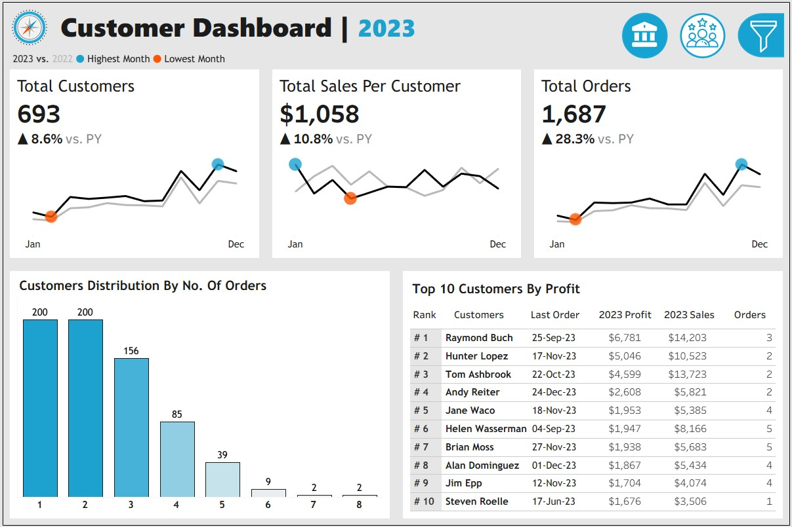

# 📊 Tableau Project: Sales & Customer Analytics Dashboards  

This project includes **two interactive dashboards built in Tableau** to analyze **Sales Performance** and **Customer Behavior**. The goal is to transform raw data into clear insights that help managers and executives make better decisions.  

---

## 🚀 Dashboards Overview  

### 🔹 Sales Dashboard  
- Year-over-Year KPIs: **Sales, Profit, Quantity**  
- Monthly & Weekly trends with peak/low highlights  
- Product subcategory performance (**Sales vs Profit**)  
- Weekly benchmarks with above/below average indicators  

### 🔹 Customer Dashboard  
- KPIs: **Total Customers, Orders, Sales per Customer (YoY)**  
- Monthly customer activity (highest/lowest months)  
- Customer distribution by order frequency  
- **Top 10 Customers by Profit** with rank, sales, orders & last order date  

---

## ⚡ Features  
- Dynamic **year selection** for historical analysis  
- Filters by **Category, Subcategory, Region, State, City**  
- Fully interactive charts and smooth navigation  

---

## 🛠️ Tools & Skills  
- Tableau (Visualization, KPI design, Dashboarding)  
- Data Cleaning & Preparation  
- Business Analytics & Insights  

---

## 📸 Screenshots  

### Sales Dashboard  
  

### Customer Dashboard  
    

---

## 📌 Key Takeaway  
This project demonstrates expertise in **data visualization, KPI-driven analysis, and dashboard interactivity** using Tableau, showcasing practical skills for real-world business analytics.  

---
